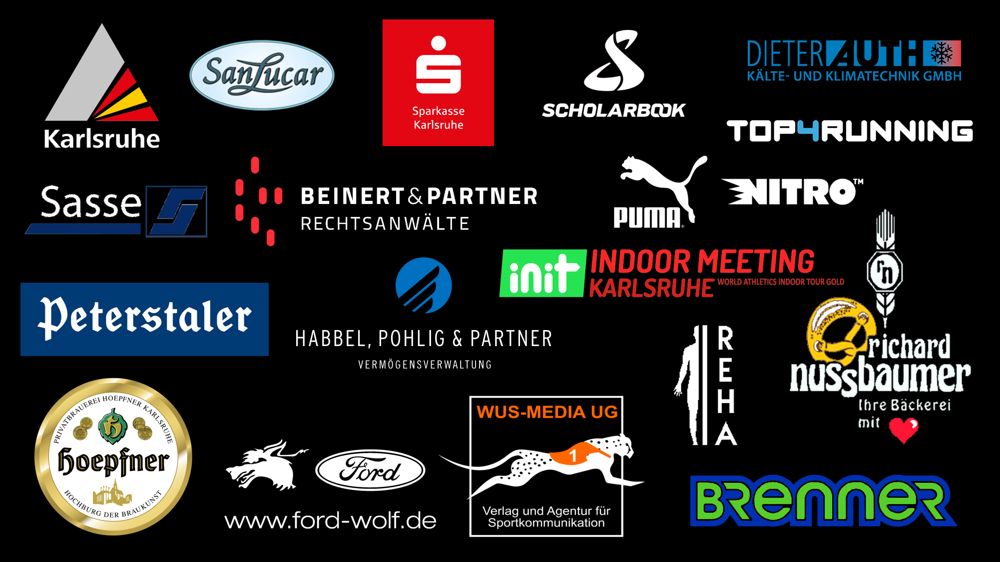
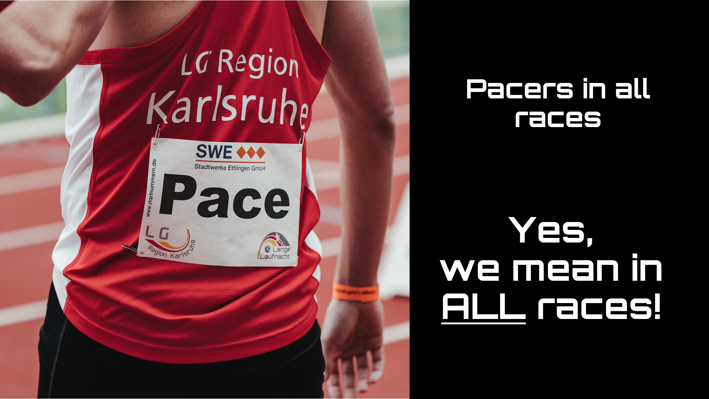

# SUMMARY 

	This project is used to create the Webapp for the LLN Videoscreen.
	It's featuring a timetable with collapsible accordions. Klick on an event to un-collapse 
	it and show the sponsors Logo.

# How to use

# opening the Webapp 

	The main file is "index.html". Open it to view the Webapp in any Browser.
	
	
	
	s - overview with all sponsors
	
	
	l - LGR advertisement
	
	
	p - 'pacers in all races'
	
	
	t - thunderstorm (due to bad weather forecast in 2025)
	

## replace images or make changes to the timetable

	The project folder contains Images, Logos (LLN, WAC) and Sponsors (Logos as well) folders.
	If you want to change a main logo of the Webapps header (LLN, WAC) replace that existing 
	logo in the respective folder and keep the name exactly the same.

	For creation of a new Webapp, a table with all events is required. It has to contain the columns 
		"Lauf","m/w","Nummer","Buchstabe","Zeit","Pace","Partner"

	They do not necessarily need to contain anything though. 
	The table needs to be in .csv format with "," as delimiters.
	You can create an excel table and export it in the desired format.

## Adding new Sponsors

	Open the generate_html.py file.
	Find the dictionary logo_files{}.
	Add a new option:

	"key [sponsor name used in the table]":"image file name",

	The script will automatically search for entries in the dictionary and put the images in the 
	accordions. It's case sensitive so watch out for any mistakes.

 